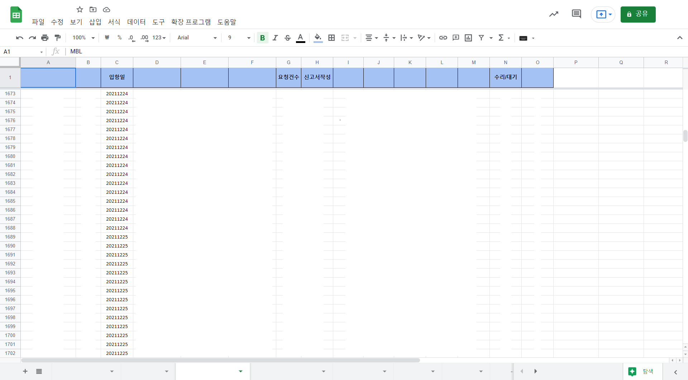
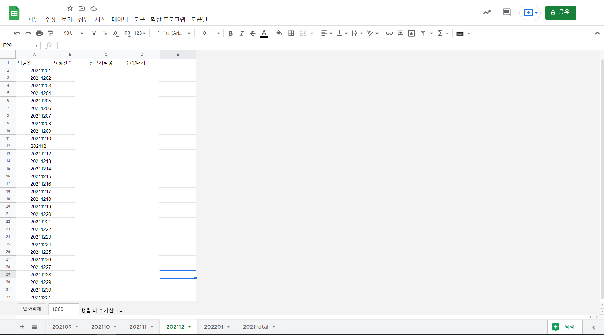

  

# RPA
## Outline
매일마다 일별로 수백 건씩 생성 및 저장되는 구글스프레드 시트에서 필요한 항목만 추출하고 자동으로 새로운 시트에 저장 및 관리할 수 있고, 일별 업무의 실적을 Jandi의 Webhook 서비스를 통해 매일 정해진 시간에 메시지를 전송해주는 기능입니다.
## Description
> 1. CNI_RPA 
> 
> 
> - 특정 시트에서 필요한 항목 (입항일/요청건수/신고서작성/수리.대기) 들만 추출
>
> 
>
> 
>
> - 새로운 스프레드시트를 생성하고 위에서 추출한 항목을 바탕으로 월별, 연도별로 입력
>
> 2. JANDI_webhook
>
> 
>
> - 1번에서 매일 자동적으로 입력되는 일별 업무의 실적을 Jandi 메시지로 전송
>
> 3. CS_RPA
>
> 
>
> - 위와 같은 방법으로 필요한 항목 추출 후 새로운 시트를 생성해서 내용 입력